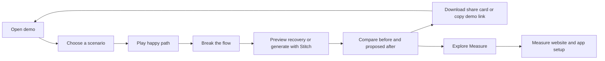

# Measure Flow — Product and Marketing Guide

## What you have

A responsive marketing demo in `C:\Users\hp\Documents\vscodee\measure-flow`. It combines a mobile screen, an animated journey, and a simulated event timeline. Its purpose is to encourage developers to explore Measure after seeing why a polished interface alone cannot explain production failures.

No video was created, as requested. The “Watch the story” button is an optional short in-page replay, not a video generator or export feature.

## Run locally

Requires Node 22.13 or later. From the project directory:

```powershell
npm install
npm run dev
```

Open the local URL printed by the server. The current development preview uses `http://127.0.0.1:5173/`.

If the machine's npm shim fails, use its installed npm entrypoint directly:

```powershell
node "C:\Program Files\nodejs\node_modules\npm\bin\npm-cli.js" run dev
```

## Visitor flow



1. **Open:** The headline introduces the hook: “You built the happy path. Now break it.” The working demo is immediately below.
2. **Choose:** Search timeout, upload interrupted, or checkout failure. Changing scenario resets the current flow and cancels stale frontend result handling.
3. **Play flow:** The sample phone loads and shows its success state. The diagram indicates progress.
4. **Break the flow:** The phone becomes an unhelpful error screen. The journey branches into failure and the timeline highlights the request.
5. **Recovery:** Without credentials, Preview recovery loads a labeled prepared example. With a configured connection, Design with Stitch requests a real generated design.
6. **Compare:** Original and proposed screens appear side by side. The new path offers an explicit recovery action.
7. **Share:** Share the story opens a preview, PNG download, and copy-link action. The PNG summarizes the before/after flow; it is not a literal export of Stitch's screen. It includes the source label and Measure destination.
8. **Convert:** Explore Measure and Monitor your real app link to Measure with campaign parameters.

## Demo semantics

The journey, events, timings, request failures, and recovery behavior are simulated. They are not collected from a real monitored application. A generated screen is a proposal, not an implemented fix.

The checkout example requests an order-status check before another payment. The upload example preserves local selection but does not claim server-side resume support.

## Where Stitch is integrated

Frontend → `POST /api/stitch` → server-side SDK → Stitch MCP → preview image → comparison.

Integration code: `app/api/stitch/route.ts`. SDK is pinned to `@google/stitch-sdk@0.3.5`. The adapter uses `createProject` or a configured project, generates a mobile recovery design, and retrieves its image URL. Returned assets must use approved HTTPS Google asset hosts; no generated HTML is executed.

`GET /api/stitch` reports only whether live generation is enabled, never credentials.

### Enable live generation

1. Obtain your own Stitch API key through the provider's supported setup.
2. Keep it server-side. Never paste it into a client component or commit it.
3. Set these environment values locally in the ignored `.env`, and through Sites secrets for a hosted deployment:

```dotenv
STITCH_ENABLED=true
STITCH_API_KEY=your-private-key
STITCH_PROJECT_ID=optional-existing-stitch-project-id
```

4. Restart the local preview or redeploy the hosted version so the environment is applied.
5. Open Stitch integration and confirm Connected. Generate a test design and verify the returned preview.

Hosted live generation additionally requires the authenticated identity supplied by the private Sites deployment. The local starter supplies its mock sign-in identity. Do not bypass this check for an unrestricted public rollout.

The current session had no Stitch credentials, so credentialed generation could not be tested. A prepared recovery is never presented as live output. On provider failure the UI reports failure; the prepared example remains available through the integration dialog.

## Backend limits

This is a lightweight demo backend, not a production generation platform. It accepts only three fixed scenario IDs, checks origin and identity, caps body size, rejects overlapping calls per server instance, and applies a one-minute per-instance cooldown. It does not retry mutations automatically.

Generation runs in one request with a three-minute provider timeout. A browser refresh can lose the displayed result; provider work may still complete. There is no durable queue, cross-instance quota, persistent job store, billing system, or public abuse protection. Before enabling paid generation for public traffic, add durable quotas/jobs and verified authorization. Returned provider image URLs may expire.

Prepared mode requires no secrets and no external generation calls.

## Marketing use

**Audience:** mobile developers, product engineers, and teams experimenting with AI UI generation.

**Hook:** polished interfaces still fail in production.

**Payoff:** a visual recovery path is memorable, but only real monitoring supplies evidence.

**Brand hierarchy:** Measure owns the demo, CTA, and share card; Stitch is the design integration. Do not imply Google sponsorship.

Suggested post:

> You built the happy path. Now break it. Explore a mobile failure, compare a recovery design, and see why your app needs real context. Try Measure Flow.

Use the live deployment URL only after checking its audience settings. Private preview links are not public campaign links. Downloads can be shared manually; this app never posts to social networks.

Campaign parameters are included on Measure links. This demo does not collect analytics or claim a signup attribution integration. Measure CTA clicks, actual signups, and activated apps would need a separate consent-aware measurement setup. Sharing potential is a hypothesis; viral growth is not guaranteed.

## Editing guide

| File | Change here |
|---|---|
| `app/page.tsx` | Scenarios, flow states, phone content, buttons, share-card rendering |
| `app/globals.css` | Colors, responsive layout, typography, animation |
| `app/api/stitch/route.ts` | Provider adapter and access checks |
| `app/layout.tsx` | Page title and description |
| `public/favicon.svg` | Site icon |
| `docs/stitch-research.md` | Cited provider facts and version caveats |
| `docs/decision-map.md` | Settled scope and decisions |

## Skill application

- [Wayfinder](https://www.aihero.dev/skills-wayfinder): decisions were recorded separately from the build. The user-approved PRD already settled the product scope.
- [Research](https://www.aihero.dev/skills-research): a bounded background research agent verified the provider's published package and source, producing the cited research note.

These were applied to this task; no global skill installation was performed.

## Verification and known limitations

Check `docs/verification.md` for actual test results. Native screen text is deliberately scaled inside the miniature phone preview; campaign controls and responsive layout are independently usable. Real Stitch success remains unverified without credentials. Browser WebMCP support is optional; ordinary browser controls work without it.

## Visible Stitch workflow update

The main headline now introduces Stitch first: “Design it with Stitch. See it through Measure.” A three-step strip connects prompt-to-screen, Measure failure context, and Stitch recovery.

The on-page Stitch workspace shows a scenario-specific design brief, Calm editorial / Bold violet presets, Create screen · demo, context from Measure, and Stitch recovery · demo. The selected preset changes the prepared phone design. Initial screen creation is explicitly a frontend simulation; it does not call Stitch. Recovery uses the existing live backend only when credentials are configured. Otherwise it remains a labeled prepared example. Live recovery follows the backend's curated design constraints; the theme selector controls the prepared frontend preview.

The app journey is displayed below the canvas. Measure keeps the real-product destination and campaign CTA. No video was added.
